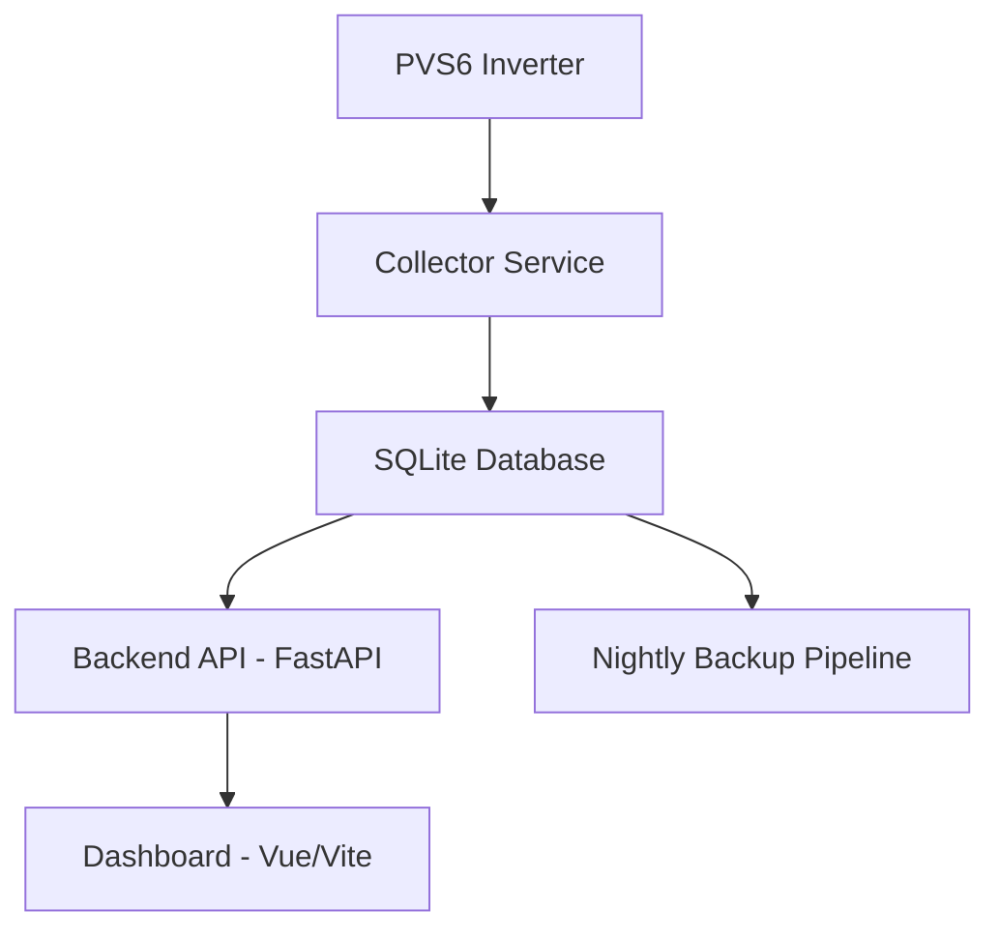

# System Architecture Overview

The PVS6 Monitoring System is a modular, full-stack platform composed of four major subsystems: the Collector, Backend API, Dashboard, and Backup Pipeline. These components work together to provide reliable, real-time solar monitoring.

---

## High-Level Architecture

## Data Flow Summary

### 1. **Collector → Database**
- Polls inverter at fixed intervals  
- Parses raw inverter responses  
- Writes structured data into SQLite  

### 2. **Database → Backend API**
- FastAPI exposes system status, panel data, and historical metrics  
- Lightweight, low-latency endpoints  

### 3. **Backend API → Dashboard**
- Dashboard fetches data via REST  
- Renders charts, system status, and production metrics  

### 4. **Database → Backup Pipeline**
- Nightly cron job creates compressed backups  
- Retention + integrity validation ensures long-term reliability  

---

## Deployment Model

All services run under **systemd**, providing:
- Automatic restarts  
- Logging via journald  
- Dependency management  
- Environment file support  

This enables a production-grade deployment on lightweight hardware.

---

## Technology Stack

| Layer | Technology |
|-------|------------|
| Collector | Python |
| Backend API | FastAPI |
| Database | SQLite |
| Dashboard | Vue + Vite + TypeScript |
| Services | systemd |
| CI/CD | GitHub Actions |
| Backup | Bash + cron |

---

## Architectural Goals
- Reliability  
- Simplicity  
- Local-first operation  
- Maintainability  
- Clear separation of concerns  

