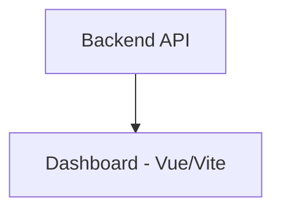

# Dashboard (Vue/Vite)

The dashboard provides a modern, responsive interface for viewing real-time and historical solar production data.

---

## Responsibilities
- Render system overview
- Display panel grid
- Show daily and historical charts
- Handle error/offline states
- Provide responsive layout

---

## Architecture

