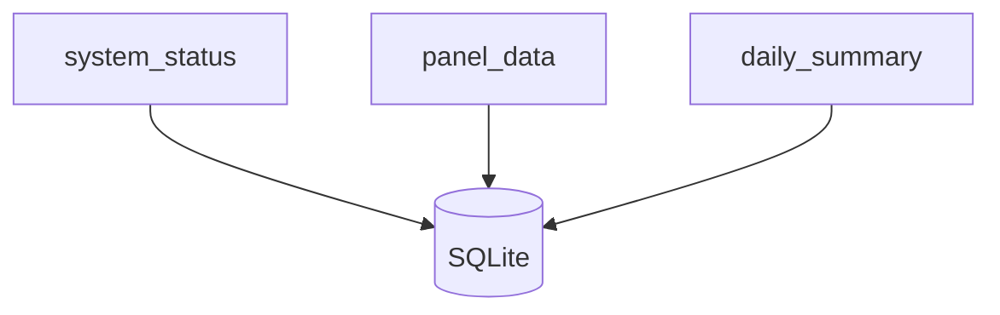

# Database Schema

The PVS6 Monitoring System uses a lightweight, file‑based SQLite database to store real‑time and historical solar production data. SQLite is chosen for its simplicity, reliability, and zero‑maintenance footprint — ideal for embedded deployments.

---

## Schema Overview

The database contains three primary tables:

- `system_status` — high‑level inverter and system metrics  
- `panel_data` — per‑panel readings  
- `daily_summary` — aggregated daily production metrics  

---

## Entity Diagram



---

## Tables

### **system_status**
Stores the most recent inverter‑level metrics.

| Column | Type | Description |
|--------|------|-------------|
| `timestamp` | TEXT | UTC timestamp of reading |
| `voltage` | REAL | System voltage |
| `current` | REAL | System current |
| `power` | REAL | Instantaneous power output |
| `temperature` | REAL | Inverter temperature |
| `status` | TEXT | Online/offline/error state |

---

### **panel_data**
Stores per‑panel readings for granular visibility.

| Column | Type | Description |
|--------|------|-------------|
| `timestamp` | TEXT | UTC timestamp |
| `panel_id` | INTEGER | Panel index or identifier |
| `voltage` | REAL | Panel voltage |
| `current` | REAL | Panel current |
| `power` | REAL | Computed panel power |
| `status` | TEXT | OK/offline/fault |

---

### **daily_summary**
Stores aggregated daily metrics for analytics and dashboard charts.

| Column | Type | Description |
|--------|------|-------------|
| `date` | TEXT | YYYY‑MM‑DD |
| `energy_kwh` | REAL | Total energy produced |
| `peak_power` | REAL | Max instantaneous power |
| `min_temp` | REAL | Lowest inverter temperature |
| `max_temp` | REAL | Highest inverter temperature |

---

## Design Goals
- **Simplicity** — easy to query, easy to back up  
- **Reliability** — ACID‑compliant storage  
- **Low overhead** — ideal for embedded hardware  
- **Traceability** — timestamps on all records  

---

## Future Enhancements
- Indexing for faster historical queries  
- Partitioned tables for long‑term storage  
- Optional migration to PostgreSQL for multi‑site deployments  

---
```
