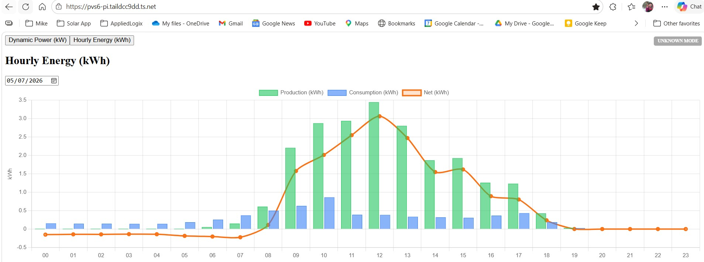
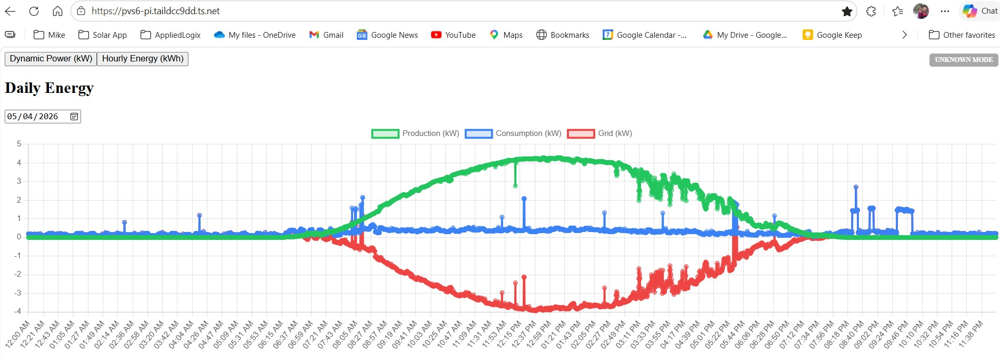
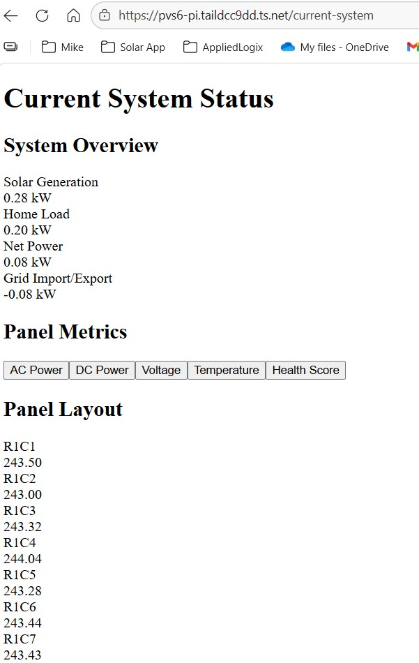
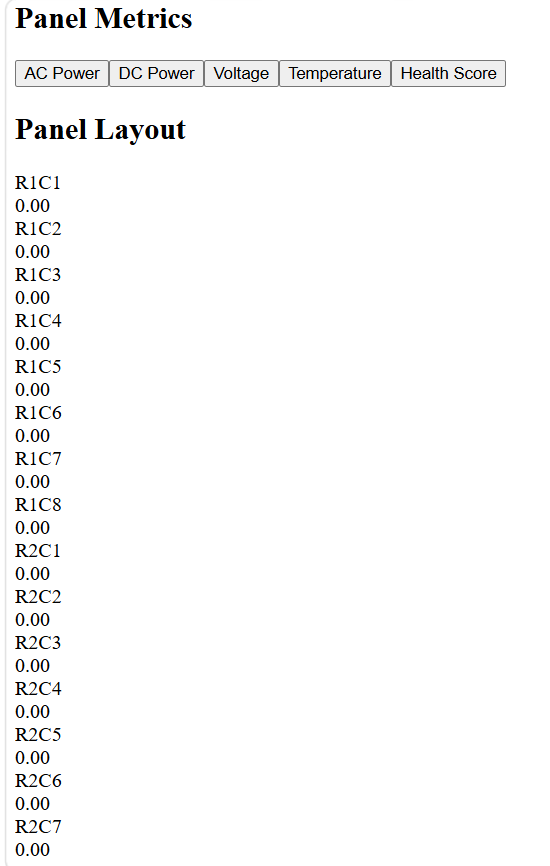

# UI Walkthrough

The PVS6 Monitoring System UI is organized into two primary views:

- **Dashboard** — focused on energy and power over time  
- **Status** — focused on current system operating conditions  

This page walks through each view and what it represents.

---

## Dashboard

The Dashboard provides a time‑based view of system behavior. It can display either:

- **Hourly energy (kWh)** for a selected day, or  
- **Instantaneous power (kW)** over time  

A toggle or control allows switching between these two modes.

### Hourly Energy (kWh) Mode

In this mode, the chart shows how much energy was produced in each hour of the day.

- Bars represent **kWh per hour**  
- Useful for understanding production patterns  
- Helps compare morning vs. afternoon performance  

### Instantaneous Power Mode

In this mode, the chart shows **instantaneous power (kW)** over time.

- Line chart of power vs. time  
- Useful for seeing ramps, dips, and cloud effects  
- Helps visualize inverter behavior throughout the day  

---

## Status Page

The Status page focuses on **current system conditions**—what the system is doing *right now*.

### System Overview Metrics

The top section shows four key real‑time values:

- **Solar Generation** — current solar power output (kW)  
- **Home Load** — current power consumption of the home (kW)  
- **Net Power** — solar minus load (kW), indicating import/export tendency  
- **Grid Import Power** — power currently being drawn from the grid (kW)  

These values provide an at‑a‑glance view of how the system is interacting with the home and the grid.

---

## Panel Layout (if present on Status page)

Below the system overview, the Status page can include a **panel layout** showing per‑panel metrics.

Each panel tile may include:
- Panel ID (e.g., R1C1, R1C2, etc.)  
- Current power or voltage  
- Basic health indication (if available)  

This layout helps identify underperforming or offline panels.

---

## Mobile Behavior

Both the Dashboard and Status views are designed to remain usable on smaller screens:

- Charts stack vertically  
- System overview cards wrap into multiple rows  
- Text and numbers remain legible on mobile devices  

---

## Future UI Enhancements

Planned improvements include:

- Clearer mode toggle between hourly kWh and instantaneous power  
- Additional context on net vs. grid power  
- Visual indicators for import vs. export  
- More detailed per‑panel metrics on the Status page  

